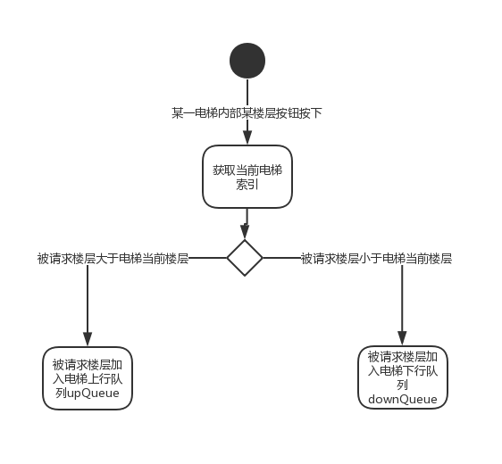
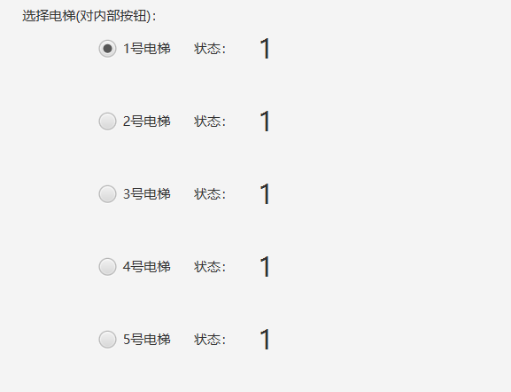

# 电梯调度设计方案报告

##### 1652613 白皓月

开发语言为java，界面基于javafx构建

# 项目背景

某一层楼20层，有五部互联的电梯。基于线程思想，编写一个电梯调度程序。 功能描述如下：

- 每个电梯里面设置必要功能键：如数字键、关门键、开门键、上行键、下行键、报警键、当前电梯的楼层数、上升及下降状态等
- 每层楼的每部电梯门口，应该有上行和下行按钮和当前电梯状态的数码显示器
- 五部电梯门口的按钮是互联结的，即当一个电梯按钮按下去时，其他电梯的相应按钮也就同时点亮，表示也按下去了
- 所有电梯初始状态都在第一层。每个电梯如果在它的上层或者下层没有相应请求情况下，则应该在原地保持不动
- 调度算法自行设计

# 需求分析

电梯调度算法即电梯响应用户的请求来进行不同楼层间的移动，而用户的请求可以分为两类：

- 内部请求：用户在电梯内部按指定楼层键，请求电梯送至相应楼层
- 外部请求：用户在不同楼层按向上或向下键，请求电梯前来所在楼层接乘

电梯调度算法将请求分配入对应电梯的响应队列，电梯在运行中响应这些请求。

由于五部电梯按钮相互联结，实际上等同于只有上行下行两个按钮，为了节省界面空间，界面上每层楼只画这两个按钮。

五部电梯每部电梯的内部都有20层楼的按钮，在界面上全部展示就是100个按钮，太过占空间而且混乱，所以界面上只设置20个楼层的按钮，按下按钮前可以在单选框中选择控制的是哪部电梯。

# 算法设计

采用面向对象的思想进行算法设计，建立电梯类Elevator，调度器类Controller，界面上发出命令的电梯内部和外部的按钮均与Controller里响应的属性绑定，按钮按下的相关事件处理函数即是分配内外请求的算法。

为了模拟实际，采用多线程的思想，每一部电梯的运行均开辟一个线程。

为了减少Controller和Elevator耦合度，Controller并不直接去干预电梯的运行，只是将电梯内部的请求或外部的请求加入指定电梯的任务队列内，由电梯不断地去响应各自的上行请求队列和下行请求队列。

## Elevator类

每个电梯内部均有待响应的请求队列，请求队列不区分是电梯内部按钮的请求还是外部楼层按钮的请求，只区分是上行请求还是下行请求。上行请求队列是`upQueue`,下行请求队列是`downQueue`。电梯所处的楼层用`currentFloor`表示.

这里的`upQueue`和`downQueue`均为优先队列，但不完全是java自带的`PriorityQueue<Integer>`,而是自定义的`MyPriQueue`，对`PriorityQueue`进行了继承，我重写了`PriorityQueue`的add方法，以实现优先队列里边没有重复的数字，这样就不会出现同一个楼层按钮连续按了多次电梯也响应多次的bug。`downQueue`构造时传入自定义的比较函数，以实现高楼层在队列头部，在下降过程中优先响应。

由于各电梯线程运行时主要执行run方法，看run方法的大体架构即很容易理解电梯是如何响应上行和下行请求的。

```java
@Override
    public void run() {
        while(true){
            while(upQueue.size() > 0) {
                status = UP;
                mySleep(500);
                if(upQueue.peek() != currentFloor) {
                    currentFloor++;
                }
				...
                if(upQueue.peek() == currentFloor) {
                    upQueue.poll();
                	...
                }
            }
            while(downQueue.size() > 0) {
                status = DOWN;
                mySleep(500);
                if(downQueue.peek() != currentFloor) {
                    currentFloor--;
                }
                ...
                if(downQueue.peek() == currentFloor) {
                    downQueue.poll();
                	...
                }
            }
            status = PAUSE;
        }
    }
```


电梯的运行分三个状态：UP，DOWN，和PAUSE，由以上代码可以看出，只要电梯在上升且有待响应的上升请求，电梯的状态就是UP，上升过程中的中途停靠并不会改变电梯的状态，且电梯不会在还有上行请求未处理的情况下去响应下行请求，这也与我们实际生活相符。当上升请求都响应完了，如果有下行请求的话电梯转为DOWN状态，只有当电梯没有任何待响应的请求是电梯的状态才是PAUSE。电梯下行和上行的写法完全是对称的，所以下行不再赘述。其实可以看到，比如电梯从1楼到达20楼，不管中途如何停靠，电梯的状态始终是UP，再从20楼载客到1楼时，电梯的状态也始终是DOWN，电梯没有任何待响应的请求时，状态才会变为PAUSE。在理解了电梯三个状态的前提下，就十分容易理解Controller里相关的调度算法。

## Controller类

Controller类其实本来是idea创建javafx application是自动生成的，也是定义界面的fxml文件绑定的控制器，fxml文件里每个拥有fx:id的UI组件在Controller里都有对应的属性变量。所以介绍Controller类时也离不开介绍界面。


### 电梯内部请求

界面中20个内部按钮都存储在`public Button[] insideFloorButtons`里，为了楼层和相应的数组索引正好对应，数组中的0位置不赋值（代码中所有类似的数组变量都采用了类似的设计，数组0位置不赋值以使索引与实际的序号对应）。设置每个电梯内部按钮按下的事件处理函数为`handleInsideOrder`，通过数组索引获得对应的楼层号`chosenFloor`，作为参数传入。五部电梯存储在`public Elevator[] elevators`变量里，`handleInsideOrder`函数每次执行前都会检查选择电梯的单选框，获得当前内部电梯的索引`elevatorIndex`。

内部请求的调度十分简单，即如果请求楼层大于当前楼层，即加入本电梯的`upQuque`，如果请求楼层小于当前楼层，即加入本电梯的`downQueue`。请求楼层等于本层时不响应。

```java
       if(chosenFloor > elevators[elevatorIndex].currentFloor) {

            elevators[elevatorIndex].upQueue.add(chosenFloor);
        }
        if(chosenFloor < elevators[elevatorIndex].currentFloor) {
            elevators[elevatorIndex].downQueue.add(chosenFloor);
        }
```



### 电梯外部请求

图中各楼层上下按钮即外部请求的区域，存储在`public Button[] outsideUpButtons`里和`public Button[] outsideDownButtons`，由于各楼层上下按钮与右方可视化的标注楼层正好对应，所以界面中没有再额外标注楼层。

#### 上行请求

电梯上行按钮对应的事件处理函数为`handleOutsideUpOrder`，当某一楼层的上行按钮被按下时，时间处理函数会首先“顺路”的电梯中找最近的（此时顺路的电梯即为处于UP状态，且电梯当前的楼层`currentFloor`小于上行按钮对应的楼层`outsideCurFloor`的电梯)。然后在处于PAUSE状态的电梯中找最近的，然后这两种状态电梯中更近的电梯即会被选中。如果“顺路”的电梯和处于PAUSE状态的电梯与请求的楼层距离一样是，会优先选择“顺路”的电梯，这也与实际相符，也是为了节省“资源”。

上行按钮请求只会在这两种状态的电梯里选择去调度，如果没有这两种状态的电梯，无法预测剩下的电梯调度哪个会来得最快，所以会等待一段时间直到出现这两种状态的电梯了再去选择调度。

如果找到了电梯，则将发出上行请求的楼层与该电梯所处的楼层进行比较。实际上，如果找到的电梯是UP状态，那电梯所处楼层一定是小于发出上行请求的楼层的，因为这样才能满足“顺路”的要求，但是PAUSE状态的电梯所处楼层在发出上行的请求楼层的上方和下方都有可能，所以为了方便还是统一比较一下。如果此楼层大于电梯所处楼层的话，就将此楼层加入电梯的上行队列。如果此楼层小于电梯所处楼层的话，就将此楼层加入电梯的下行队列。

而与内部请求不同的是，如果此楼层等于电梯所处楼层的话，也是会加入上行队列或下行队列的。因为根据生活经验，我们在外部就是靠上行或下行按钮控制电梯开门。假设电梯处于UP状态，电梯在某一层短暂停靠，如果我们这一层不断按上行按钮，因为电梯的上行队列`upQueue`是优先队列，本层一定会是队列中最小的，那电梯就会不断响应本层的上行请求，停在这层不断开门。这与实际的电梯是完全相符的。而电梯内部因为有独立的开门按钮，所以电梯并不会响应内部本层的请求。

而在处理上行请求的时候，此楼层等于电梯所处楼层的话，需要加入电梯的上行队列`upQueue`，因为上行请求只可能调度处于UP状态和PAUSE状态的电梯，对于UP状态的电梯，只有加入`upQueue`里才能实现开门效果，因为加入`downQueue`的话在电梯还有上行请求未响应的情况下是不会立即响应`downQueue`里的请求的。而对于PAUSE状态的电梯，加入两种队列都可以，所以为了方便统一加入`upQueue`.

#### 下行请求

电梯下行按钮对应的事件处理函数为`handleOutsideDownOrder`,其和上行按钮的事件处理函数完全是对称的写法。在此解释一些不同点。

第一个就是此时“顺路”的定义就不一样了，处理下行请求的时候顺路的电梯为处于DOWN状态，且电梯当前的楼层`currentFloor`大于下行按钮对应的楼层`outsideCurFloor`的电梯

第二个不同点是当发出下行请求的楼层等于被选电梯所处的楼层的话，要加入被选电梯的下行队列`downQueue`，理由同上，这里不再赘述。


## 其他设计细节

以上关于内外请求部分的解释即为调度的核心逻辑了，然而程序存在一些重要的设计细节，在这部分进行介绍。而Controller类里诸多以init开头的组件初始化函数，都是一样的逻辑，都是采用`root.lookup("#...")`函数去将属性变量与ui组件对应，如果是Button就再加上事件函数，不再进行详细解释。

### 开门

在前述的Elevator类的run函数里，每到达一个楼层，即`if(upQueue或downQueue.peek() == currentFloor)`时，都会调用Elevator类的`openDoor`函数。在解释如何响应外部请求时，已经详细解释了如何使外部的上行和下行按钮作为同一层电梯的开门命令的。而电梯内部开门按钮的事件处理函数，也是通过将电梯所处的楼层加入上行或下行队列来实现开门的。理由同介绍外部请求时的说法，都是利用了电梯的`upQueue`和`downQueue`是优先队列的特性。

```java
   public void openDoor() {
        if(upQueue.size() == 0 && downQueue.size() == 0 ) {
            status = PAUSE;
        }
        mySleep(1500);
        ...

    }
```

函数的大体结构如上，省略的部分均为UI设置。贴出函数的原因是为了解释一个细节，由于开门所用时间较长，如果电梯即将进入PAUSE状态就在`mySleep`提前将电梯设置为PAUSE状态，否则在这1500ms内，较近的低层请求楼层可能仍然以为电梯的状态是UP或者DOWN不符合其要求而舍近求远地调度了其他电梯。

### 电梯和待响应的外部请求的对应

这个部分主要是介绍此程序的设计中是如何处理一种特殊情况的：即同一层的上行和下行按钮被同时按下时是如何处理的。这种情况要求要来两部电梯，但是如果只按前述设计的话，考虑一种情况：所有电梯都处于1层且处于PAUSE状态，如果6层的下行按钮先被按下，则有一部电梯会转为UP状态去6层，如果紧接着6层的上行按钮被按下，则调度程序会先找“顺路”的最近的电梯，那选中的还是同一部电梯。如果先按上行按钮，再按下行按钮，来的电梯是两部，但是来的这部电梯响应的是哪个请求呢，这决定了外部按钮的显示灯如何熄灭，也指示了发出请求的乘客应该上哪部电梯。

故对每层楼的上行和下行按钮，都记录其选择调度的是哪部电梯。主要有两个用途：第一个是当对应的电梯到达楼层的时候，即把调度它的上行或者下行按钮的指示灯熄灭。第二个是用途是，如果同一层的上行按钮已经调度了某一台电梯，那同一层紧接着按下的下行按钮在选择电梯时就不会考虑这部已经被上行按钮调度的，以达到同一层上下按钮同时按下时来两部电梯的效果。

# 功能展示

这里只展示基本的界面，并没有展示调度逻辑如何应对各种复杂的情况。请自行运行程序检验。

## 内部请求

例：发出内部请求时可以先选择电梯，再去按内部的楼层按钮。



电梯状态显示能显示当前楼层和上行，下行和开门的状态。此状态显示器同时作为电梯内部的显示器和外部此电梯对应位置的显示器。


电梯内部楼层按钮按下时变为蓝色，发出内部请求，当电梯到达对应层后按钮即恢复本来的颜色。同时可以有多个按钮被按下。


开门按钮当电梯处于PAUSE状态时可以按下打开门，当电梯在某层短暂停留时也可以按下来打开门，电梯的显示变为open，不断按的话会在某层持续停留。但是当电梯处于运行状态时开门按钮无效。


点击报警按钮会在下方区域显示，对应现实中电梯总控室的显示屏。


## 外部请求

各楼层上下行按钮从下到上依次为1-20层，与右方电梯运行状态可视化的楼层标注一致。

同上，当按钮按下时会点亮为蓝色，当所调度的电梯到达时按钮恢复为灰色。同一层的两个按钮同时按下，电梯到达时会区分调度此电梯的是哪个按钮然后将按钮恢复为灰色。


